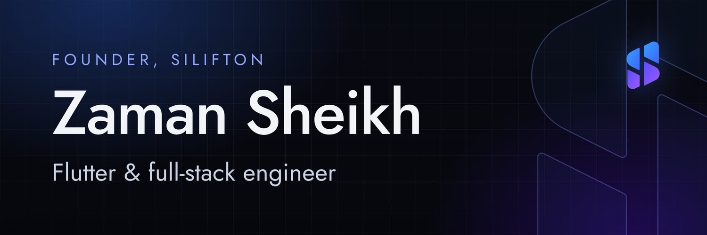

  

  
  
  
  
  

## About

I'm Zaman, founder of **[Silifton](https://silifton.com)**, an engineering studio in Dhaka and Seoul. I build mobile apps, real-time video systems and developer tools, and I like owning a product from the first commit to the day it runs in production.

- **Building:** [Silifton](https://silifton.com) and its products, including [Voxa RTC](https://voxartc.com) and [Postora](https://postora.silifton.com)
- **Focus:** Flutter, real-time video (WebRTC, LiveKit), NestJS and Next.js backends, Linux servers
- **Teaching:** free Flutter sessions in the [Silifton Discord community](https://discord.gg/Wj3keGKWus)
- **Ask me about:** Flutter, Dart, real-time apps, PDF and text shaping, Linux
- **Reach me:** [shamsuzzaman15-4031@diu.edu.bd](mailto:shamsuzzaman15-4031@diu.edu.bd) · [CV](https://zamansheikh.com/zaman_cv.pdf)

## Featured work

**[Voxa RTC](https://voxartc.com)**: an Agora-compatible real-time video engine you can self-host. Same API, your own servers. 

**[bangla_pdf](https://github.com/zamansheikh/bangla_pdf)**: correctly shaped Bangla text in PDFs, with real OpenType shaping, for Dart and TypeScript. 

**[Pagewright](https://github.com/zamansheikh/browser-mcp)**: give an AI agent a real browser, with an MCP server and a Chrome extension. 

**[git-vanish](https://github.com/zamansheikh/git-vanish)**: an interactive terminal app that removes leaked files and secrets from every commit in git history. 

**[Campus Saga](https://github.com/zamansheikh/campussaga)**: a Flutter app where students raise campus issues and administrators resolve them. 

**[ClipStack](https://github.com/zamansheikh/ClipStack)**: a free macOS clipboard manager with unlimited history, an overlay paste board and search. 

More of what I've shipped with Silifton: **[silifton.com/portfolio](https://silifton.com/portfolio)**

## Tech

   
   
  

## GitHub activity

  
  

## Competitive programming

  
  
  
  

## Connect

  
  
  
  
  

## Support my work

  If my open-source tools help you, a coffee keeps them going.  
  
  

